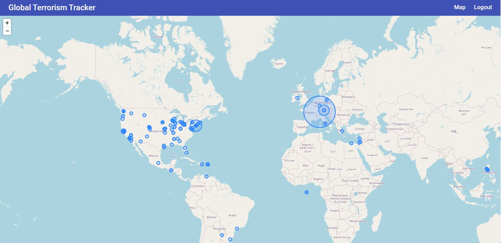
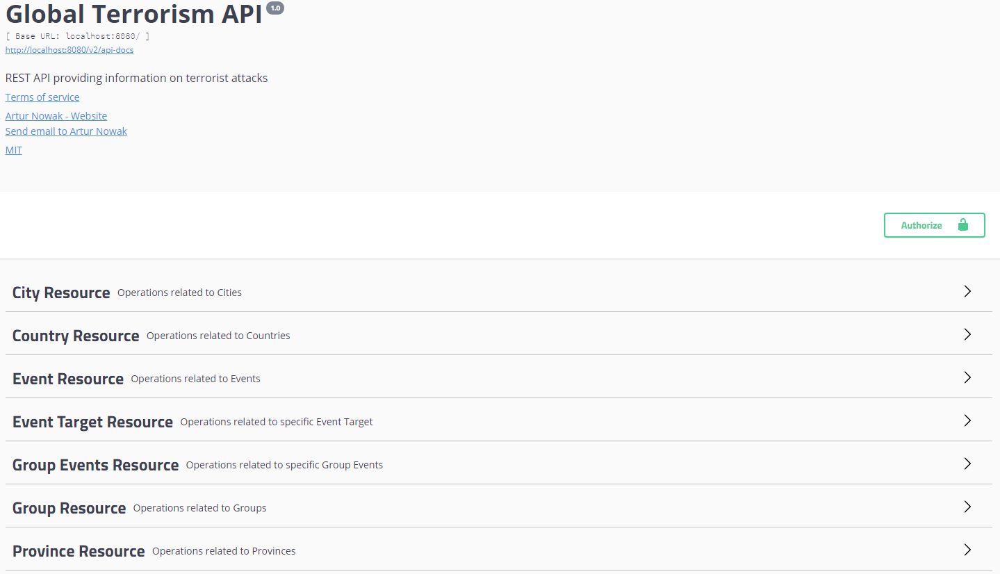

# GlobalTerrorismAPI

## Table of Contents

- [General info](#general-info)
- [Demo](#demo)
- [Built With](#built-with)
- [Status](#status)
- [Screenshots](#screenshots)

## General info

An application that allows you to track terrorist attacks around the world, created using the Spring and Angular frameworks.

## Demo

The application demos are available on the Heroku platform.

Swagger 2 API Documentation: https://global-terrorism-api.herokuapp.com/swagger-ui.html#
AngularJS App: https://global-terrorism-tracker.herokuapp.com

To log in as a user please provide:

- User name: testuser
- Password: Password123!

To access the API endpoints use the previously prepared account:

```json
# POST /api/v1/authentication
# Content-Type: application/json
{
  "userName": "testuser",
  "password": "Password123!",
  "email": "testuser123@email.com"
}
```

It may take a while for the applications to start.

Please see the README for specific applications for more information.
Backend:
https://github.com/NowakArtur97/GlobalTerrorismAPI/tree/master/server
Frontend:
https://github.com/NowakArtur97/GlobalTerrorismAPI/tree/master/client

## Built With

Backend:

- Java 11
- Spring (Boot, MVC, HATEOAS, Security, Data Neo4j) - 2.2.5
- Spring Bulk API - 0.7.0
- Swagger (Core, Ben Validation, UI) - 2.92
- Lombok - 1.18.12
- jUnit5 - 5.5.2
- Mockito - 3.1.0
- Model Mapper - 2.3.7
- Apache POI (poi, poi-ooxml) - 4.1.2
- Excel Streaming Reader - 2.1.0
- Apache Johnzon (johnzon-core) - 1.2.3
- Jackson (jackson-datatype-jsr353) - 2.10.2
- JSON Web Token Support For The JVM (jjwt) - 0.9.1
- Passay - 1.6.0
- Maven
- Docker
- Neo4j
- CircleCI

Frontend:

- AngularJS - 10.1.1
- Typescript - 4.0.2
- RxJS - 6.6.0
- NgRx Store - 10.0.0
- NgRx Effects - 10.0.0
- NgRx Entity - 10.0.1
- NgRx Store-Devtools - 10.0.0
- Angular Material - 10.2.1
- Leaflet - 1.7.1
- Chart.js - 2.9.4
- ng2-charts - 2.4.2
- Jasmine - 3.6.0
- Karma - 5.0.0
- Protractor - 7.0.0

## Status

Project is: in progress

## Screenshots



Main view with marked events



Documentation using Swagger 2
