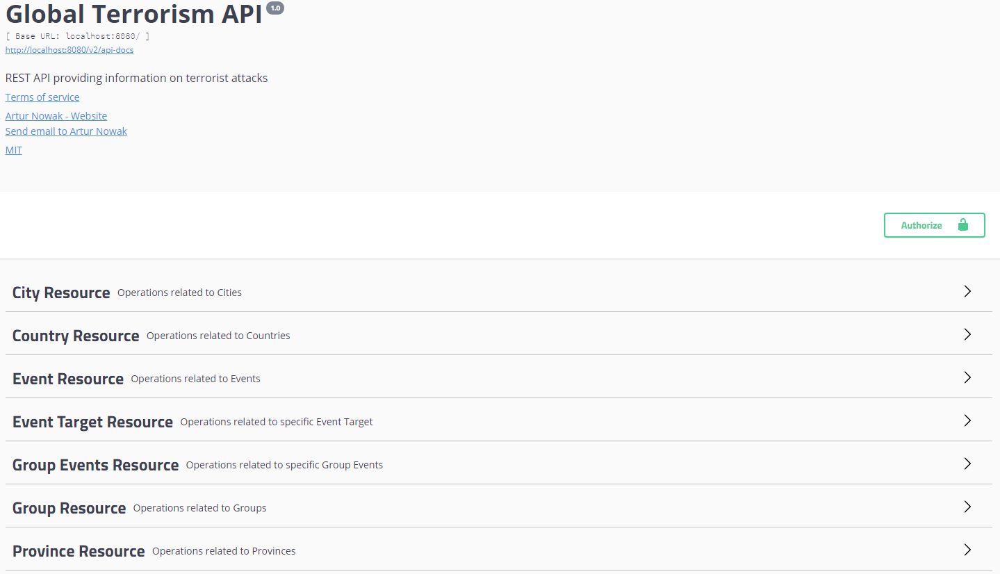

# GlobalTerrorismAPI

## Table of Contents
* [General info](#general-info)
* [Demo](#demo)
* [Built With](#built-with)
* [Features](#features)
* [To Do](#to-do)
* [Routes List](#routes-list)
* [Status](#status)
* [Screenshots](#screenshots)

## General info
REST API providing information on terrorist attacks

The data was downloaded from the Global Terrorism Database site - https://www.start.umd.edu/gtd/ and used only for learning purposes.

## Setup
To start the application, enter the following commands in command line:
- `mvnw clean package -Dspring-boot.run.profiles=docker -DskipTests`
- `docker-compose up`
Go to: `http://YOUR_DOCKER_IP:8080/swagger-ui.html`,
where YOUR_DOCKER_IP is your docker machine IP address.
To stop the application, enter the following key combination on the command line: `Ctrl + C`
To shut down the containers enter:
- `docker-compose down`

## Built With
- Java 11
- Spring (Boot, MVC, HATEOAS, Security, Data Neo4j) - 2.2.5
- Spring Bulk API - 0.7.0
- Swagger (Core, Ben Validation, UI) - 2.92
- Lombok - 1.18.12
- jUnit5 - 5.5.2
- Mockito - 3.1.0
- Model Mapper - 2.3.7
- Apache POI (poi, poi-ooxml) - 4.1.2
- Excel Streaming Reader - 2.1.0
- Apache Johnzon (johnzon-core) - 1.2.3
- Jackson (jackson-datatype-jsr353) - 2.10.2
- Maven
- Docker
- Neo4j
- CircleCI

## Features
- Target (GET, POST, PUT, PATCH, DELETE, OPTIONS)
- Event (GET, POST, PUT, PATCH, DELETE, OPTIONS)
- Group (GET, POST, PUT, PATCH, DELETE, OPTIONS)
- Group Events (GET, POST, DELETE, OPTIONS)
- Bulk operations using Spring Bulk API
- Documentation created using Swagger 2
- Loading data from an .xlsx file

## To Do
- JWT support

## Routes List:

### Targets

| Method     | URI                               | Action                                                               |
|------------|-----------------------------------|----------------------------------------------------------------------|
| `GET`      | `/api/v1/targets`                 | `Get a list of targets`                                              |
| `GET`      | `/api/v1/targets/{id}`            | `Get information about a target`                                     |
| `POST`     | `/api/v1/targets`                 | `Add a new target`                                                   |
| `PUT`      | `/api/v1/targets/{id}`            | `Update or add a target`                                             |
| `PATCH`    | `/api/v1/targets/{id}`            | `Partially update a target(consume Json Patch and Json Merge Patch)` |
| `DELETE`   | `/api/v1/targets/{id}`            | `Remove a target`                                                    |
| `OPTIONS`  | `/api/v1/targets`                 | `Find all supported request methods for list of targets`             |
| `OPTIONS`  | `/api/v1/targets/{id}`            | `Find all supported request methods for target`                      |

### Events

| Method     | URI                               | Action                                                               |
|------------|-----------------------------------|----------------------------------------------------------------------|
| `GET`      | `/api/v1/events`                  | `Get a list of events`                                               |
| `GET`      | `/api/v1/events/{id}`             | `Get information about an event`                                     |
| `POST`     | `/api/v1/events`                  | `Add a new event`                                                    |
| `PUT`      | `/api/v1/events/{id}`             | `Update or add an event`                                             |
| `PATCH`    | `/api/v1/events/{id}`             | `Partially update an event(consume Json Patch and Json Merge Patch)` |
| `DELETE`   | `/api/v1/events/{id}`             | `Remove an event`                                                    |
| `OPTIONS`  | `/api/v1/events`                  | `Find all supported request methods for list of events`              |
| `OPTIONS`  | `/api/v1/events/{id}`             | `Find all supported request methods for event`                       |

### Groups

| Method     | URI                               | Action                                                               |
|------------|-----------------------------------|----------------------------------------------------------------------|
| `GET`      | `/api/v1/groups`                  | `Get a list of groups`                                               |
| `GET`      | `/api/v1/groups/{id}`             | `Get information about a group`                                      |
| `GET`      | `/api/v1/groups/{id}/events`      | `Get information about a group's related events`                     |
| `POST`     | `/api/v1/groups`                  | `Add a new group`                                                    |
| `POST`     | `/api/v1/groups/{id}/events`      | `Add a new event to an existing group`                               |
| `PUT`      | `/api/v1/groups/{id}`             | `Update or add a group`                                              |
| `PATCH`    | `/api/v1/groups/{id}`             | `Partially update a group(consume Json Patch and Json Merge Patch)`  |
| `DELETE`   | `/api/v1/groups/{id}`             | `Remove a group`                                                     |
| `DELETE`   | `/api/v1/groups/{id}/events`      | `Remove all group's related events`                                  |
| `OPTIONS`  | `/api/v1/groups`                  | `Find all supported request methods for list of groups`              |
| `OPTIONS`  | `/api/v1/groups/{id}`             | `Find all supported request methods for a group`                     |
| `OPTIONS`  | `/api/v1/groups/{id}/events`      | `Find all supported request methods for a group's events`            |

### Bulk
| Method     | URI                               | Action                                                               |
|------------|-----------------------------------|----------------------------------------------------------------------|
| `POST`      | `/api/v1/bulk`                   | `Bulk operations`                                                    |

### Bulk Request JSON example
```json
# POST /api/v1/bulk
# Content-Type: application/json

{
  "operations": [
    {"method": "GET", "url": "/api/v1/groups"},
    {"method": "POST", "url": "/api/v1/targets", "params": {"target": "New Target"}}
  ]
}
```

## Status
Project is: in progress

## Screenshots

<p style="text-align: center">Documentation using Swagger 2</p>