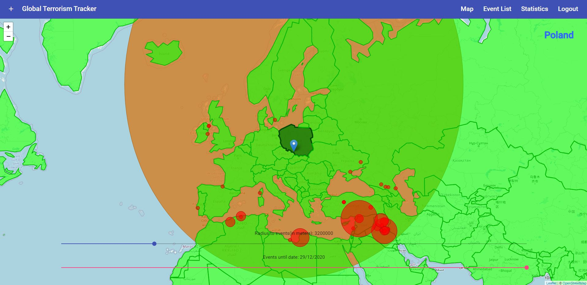
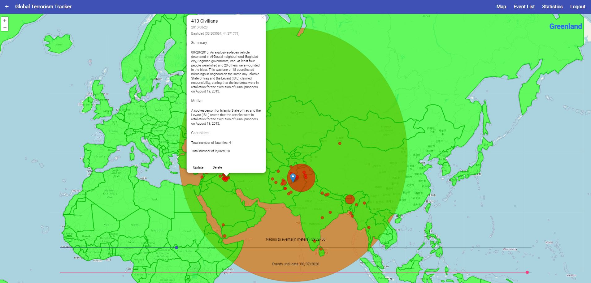
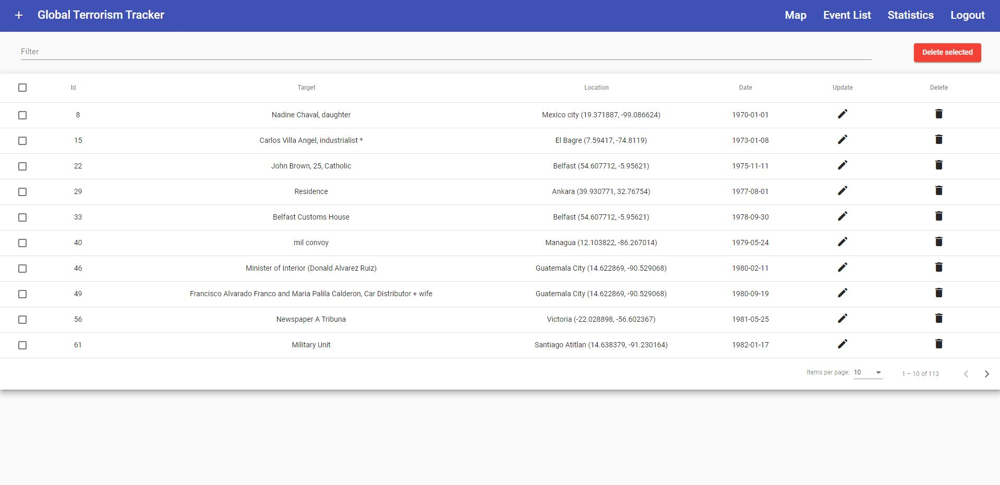
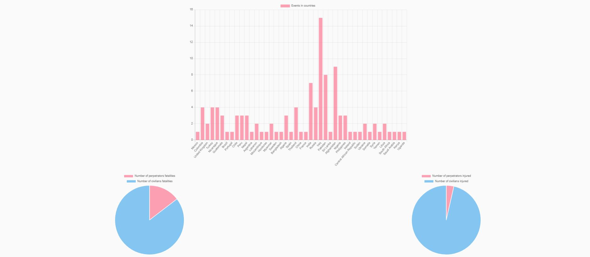

# GlobalTerrorismTracker

## Table of Contents

- [General info](#general-info)
- [Demo](#demo)
- [Setup](#setup)
- [Built With](#built-with)
- [Features](#features)
- [Status](#status)
- [Screenshots](#screenshots)

## General info

An application that allows you to track terrorist attacks around the world, created using the Angular framework.

## Demo

The application demo is available on the Heroku platform: https://global-terrorism-tracker.herokuapp.com/ 
It may take a while for the application to start.

To log in as a user please provide:

- User name: testuser
- Password: Password123!

# Setup

## Development server

Run `ng serve` for a dev server. Navigate to `http://localhost:4200/`. The app will automatically reload if you change any of the source files.

## Build

Run `ng build` to build the project. The build artifacts will be stored in the `dist/` directory. Use the `--prod` flag for a production build.

## Running unit tests

Run `ng test` to execute the unit tests via Karma.

## Running end-to-end tests

Run `ng e2e` to execute the end-to-end tests via Protractor.

## Using docker-compose

To start the application, in the folder, enter the following commands in command line:

- `docker-compose up -d`
  Go to: `http://YOUR_DOCKER_IP_OR_LOCALHOST:4200/map` where `YOUR_DOCKER_IP` is your docker machine IP address (or localhost). 
  Make sure you have launched the backend application before this. 
  It may be necessary to change the API address in the `environment.docker.ts` file in case of a different Docker address. 
  To shut down the containers enter:
- `docker-compose down`

## Built With

- AngularJS - 10.1.1
- Typescript - 4.0.2
- RxJS - 6.6.0
- NgRx Store - 10.0.0
- NgRx Effects - 10.0.0
- NgRx Entity - 10.0.1
- NgRx Store-Devtools - 10.0.0
- Angular Material - 10.2.1
- Leaflet - 1.7.1
- Chart.js - 2.9.4
- ng2-charts - 2.4.2
- Jasmine - 3.6.0
- Karma - 5.0.0
- Protractor - 7.0.0
- Docker
- CircleCI
- Heroku

## Features

- User sign in/sign up/auto login
- Displaying events markers on the map with radiuses depending on the number of victims in the attack
- Recognition of countries on the map
- Adding/updating/deleting events
- Sorting events by date
- Sorting events depending on the distance from the marker
- Displaying a list of events with the possibility of sorting, filtering and paging
- Charts with information about events and victims
- Determining the user's location
- Continuous integration and deployment with CircleCI
- Deploy on Heroku

## Status

Project is: finished

## Screenshots

Map with marked events

Map with the description of the event

List of events

Charts with information on events and victims
